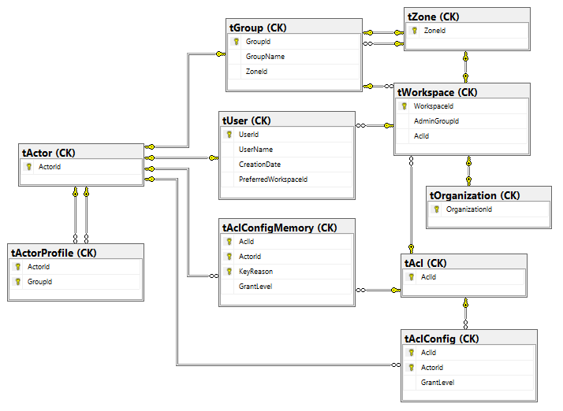

# CK.DB.Organization

This package is based on the **CK.DB.Workspace** that introduces Workspace (a Workspace is a Zone with a Acl and an administrator Group).

It adds Organizations to the picture: an Organization is a Workspace of level 0.

The relational model of this package is as follows:

Like a workspace, an organization can be plug/unplug from an existing workspace.
While creating an organization, one workspace is be created.

Only the Plateform Administrators (Grant level 112 or higher on the SystemAcl (1)) can create/plug/unplug an organization.
